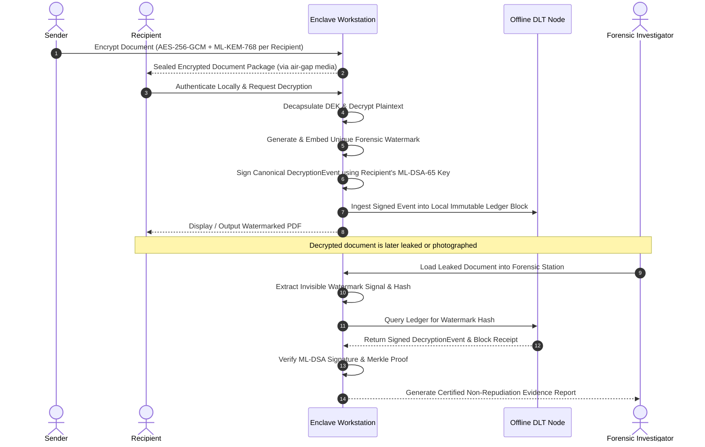

# Cryptographic Attribution & Immutable Decryption Provenance

[](LICENSE)
[](docs/architecture.md)
[](docs/ui-ux-design-system.md)
[](https://www.rust-lang.org/)

An enterprise-grade, offline, air-gapped confidential document distribution platform that provides **cryptographically verifiable attribution and non-repudiation** when a decrypted document is subsequently leaked or photographed.

The platform deliberately rejects public cryptocurrency tokens and mining in favor of **high-assurance confidential cryptography** and a **permissioned, append-only, offline Distributed Ledger Technology (DLT)**.

---

## 1. Executive Summary & Core User Story

In high-consequence national security, intelligence, and defense sectors, confidential PDF documents must be distributed across offline networks to authorized personnel. If a recipient leaks the document, traditional DRM fails because digital screenshots, scans, or exported files sever provenance.

This platform solves the leak attribution challenge through an atomic pipeline:



---

## 2. Key Cryptographic & Architectural Features

* **Symmetric Authenticated Encryption**: AES-256-GCM authenticated encryption for high-throughput confidential document payloads.
* **Post-Quantum Key Establishment**: ML-KEM-768 (FIPS 203 / Kyber) multi-recipient envelope encapsulation protecting the symmetric Document Encryption Key (DEK).
* **Invisible Forensic Watermarking**: Multi-domain spread-spectrum and glyph-positioning watermarking imperceptible to the naked eye but robust against cropping, filtering, recompression, and print-scan degradation.
* **Post-Quantum Non-Repudiation**: ML-DSA-65 (FIPS 204 / Dilithium) digital signatures over canonical RFC 8785 JSON / CBOR event serialization.
* **Permissioned Offline DLT**: Append-only Merkle-linked block structure designed for air-gapped enclaves with asynchronous sneakernet synchronization.
* **Forensic Workstation & UI**: Microsoft Fluent UI 2.0 interface supporting native Dark and Light modes, Nexa typography, smooth physics transitions, and automated evidence report generation.

---

## 3. Technology Stack

* **Core Language**: Rust (1.75+ Stable)
* **Frontend**: Vanilla HTML5, CSS3, ES6 JavaScript
* **Design System**: Microsoft Fluent UI 2.0 (Acrylic, Mica, Depth, Elevation, Smooth Motion)
* **Typography**: Nexa (with modern sans fallback: Segoe UI Variable, Apple System)
* **Cryptography**:
  * AES-256-GCM (NIST SP 800-38D)
  * ML-KEM-768 (FIPS 203)
  * ML-DSA-65 (FIPS 204)
* **Serialization**: Canonical JSON (RFC 8785) & Deterministic CBOR
* **Ledger**: Permissioned Offline DLT with Merkle Inclusion Proofs
* **Database**: PostgreSQL (Metadata only, air-gapped)
* **Testing**: Rust Built-in Test Framework + Integration Test Harness

---

## 4. Repository Structure

```text
cryptographic-attribution/
├── README.md                 # Primary project overview and architectural guide
├── CONTRIBUTING.md           # Branching rules, PR workflows, semantic commits
├── LICENSE                   # Apache-2.0 License
├── Cargo.toml                # Cargo root workspace definition
├── .gitignore                # Workspace ignore definitions
│
├── docs/                     # Architectural specifications
│   ├── architecture.md       # High-level architecture, enclaves, and data flows
│   ├── api-contract.md       # Complete API contracts for all 5 roles
│   ├── event-schema.md       # DecryptionEvent field specifications & canonical rules
│   ├── threat-model.md       # STRIDE / DREAD threat modeling & mitigations
│   ├── roadmap.md            # 4-week sprint milestones
│   ├── setup.md              # Local developer environment setup
│   └── ui-ux-design-system.md# Fluent UI guidelines, Nexa font, and dark/light tokens
│
├── shared/                   # Shared schemas and canonical models (No business logic)
│   ├── Cargo.toml
│   ├── schemas/              # Common DecryptionEvent JSON Schema
│   │   └── decryption_event.json
│   ├── models/               # Rust struct definitions for DecryptionEvent and packages
│   ├── constants/            # Cryptographic algorithm IDs, magic headers, error codes
│   ├── utils/                # Canonical serialization traits (RFC 8785 & CBOR)
│   └── src/
│       └── lib.rs
│
├── encryption/               # Member 1 — AES-256-GCM, ML-KEM, Key Management, Packaging
│   ├── Cargo.toml
│   ├── README.md
│   ├── src/
│   └── tests/
│
├── watermark/                # Member 2 — Generation, Embedding, Extraction, Robustness
│   ├── Cargo.toml
│   ├── README.md
│   ├── src/
│   └── tests/
│
├── pqcrypto/                 # Member 3 — ML-DSA, Canonical Serialization, Identity
│   ├── Cargo.toml
│   ├── README.md
│   ├── src/
│   └── tests/
│
├── ledger/                   # Member 4 — Offline DLT, Merkle Storage, Lookup, Consensus
│   ├── Cargo.toml
│   ├── README.md
│   ├── client/
│   ├── schema/
│   ├── src/
│   └── tests/
│
├── integration/              # Member 5 — Fluent UI, Workflow, Forensics, Evidence Reports
│   ├── Cargo.toml
│   ├── README.md
│   ├── backend/
│   ├── frontend/             # Fluent UI Station (theme.css, components.css, index.html)
│   ├── verification/
│   └── src/
│
└── tests/                    # Top-level workspace integration and e2e tests
    ├── integration/
    └── e2e/
```

---

## 5. Team Roles & Ownership Matrix

This repository is designed for **5 independent engineers** working in parallel without merge conflicts:

| Member | Focus Area | Owned Directory | Branch | Required API Methods |
| :--- | :--- | :--- | :--- | :--- |
| **Member 1** | Encryption & Packaging | `encryption/` | `feature/member1-encryption` | `encrypt_document()`, `decrypt_document()`, `protect_document_key()` |
| **Member 2** | Forensic Watermarking | `watermark/` | `feature/member2-watermark` | `create_watermark()`, `embed_watermark()`, `extract_watermark()`, `verify_watermark()` |
| **Member 3** | Post-Quantum Crypto | `pqcrypto/` | `feature/member3-pqcrypto` | `create_event()`, `serialize_event()`, `sign_event()`, `verify_event()` |
| **Member 4** | Offline Ledger | `ledger/` | `feature/member4-ledger` | `submit_event()`, `get_event()`, `find_by_watermark()`, `verify_ledger_record()` |
| **Member 5** | Integration & UI | `integration/` | `feature/member5-integration` | `run_decryption_workflow()`, `verify_leaked_document()`, `generate_report()` |

---

## 6. Common Event Schema Contract

All modules interact through the canonical event schema stored in [`shared/schemas/decryption_event.json`](shared/schemas/decryption_event.json):

```json
{
  "event_id": "",
  "document_id": "",
  "recipient_id": "",
  "session_id": "",
  "watermark_id": "",
  "timestamp": "",
  "watermark_hash": "",
  "signature_algorithm": "ML-DSA",
  "signature": ""
}
```

*Modules must never invent new field names or mutate this contract.*

---

## 7. Git Workflow & Collaboration Rules

```text
main (Protected)
└── develop (Integration)
    ├── feature/member1-encryption
    ├── feature/member2-watermark
    ├── feature/member3-pqcrypto
    ├── feature/member4-ledger
    └── feature/member5-integration
```

1. **Daily Work**: Each developer works on their dedicated feature branch.
2. **Pull Requests**: Pull requests target `develop`, never `main`.
3. **Commit Messages**: Follow conventional commits (`feat(encryption): ...`, `fix(ledger): ...`).
4. **Verification**: CI must pass all workspace tests before merging.

See [CONTRIBUTING.md](CONTRIBUTING.md) for detailed guidelines.

---

## 8. Quickstart & Build Instructions

### Rust Workspace Build & Test
```bash
# Check workspace compilation
cargo check

# Run all test suites
cargo test --workspace

# Run tests for a specific module
cargo test -p encryption
cargo test -p watermark
cargo test -p pqcrypto
cargo test -p ledger
cargo test -p integration
```

### Preview Fluent UI Workstation
The workstation interface is located in `integration/frontend/` and can be served locally:
```bash
# Serve static UI files locally
python -m http.server 8080 --directory integration/frontend
```
Open `http://localhost:8080` to experience the Fluent UI design system, test the Dark/Light mode switcher, and view the architectural status.

---

## 9. Documentation Directory

* [Architecture Specification](docs/architecture.md)
* [Unified API Contracts](docs/api-contract.md)
* [Decryption Event Schema](docs/event-schema.md)
* [Threat Model & Security Analysis](docs/threat-model.md)
* [4-Week Sprint Roadmap](docs/roadmap.md)
* [Environment Setup Guide](docs/setup.md)
* [UI/UX Design System & Tokens](docs/ui-ux-design-system.md)
