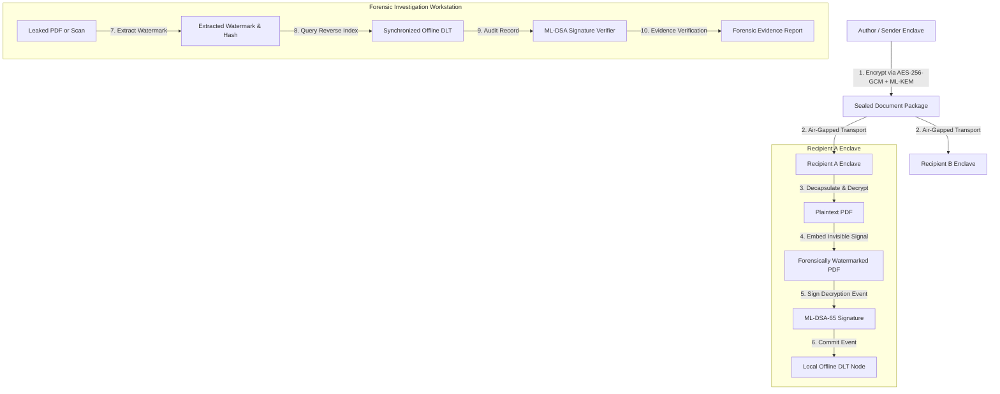

# System Architecture Specification

## 1. High-Level Vision & Objectives

The **Cryptographic Attribution & Immutable Decryption Provenance Platform** provides an offline, air-gapped confidential document distribution mechanism ensuring non-repudiable forensic attribution if a decrypted document is subsequently leaked or photographed.

The platform deliberately rejects public blockchains and cryptocurrency mechanisms in favor of a **permissioned, append-only, high-assurance distributed ledger technology (DLT)** optimized for air-gapped enclaves and sneakernet synchronization.



---

## 2. Core Cryptographic Components

| Primitive | Standard / Parameter | Purpose | Implementation Domain |
| :--- | :--- | :--- | :--- |
| **Symmetric Cipher** | AES-256-GCM (NIST SP 800-38D) | Confidentiality & authenticity of the bulk document payload | Member 1 (`encryption`) |
| **Post-Quantum KEM** | ML-KEM-768 (FIPS 203 / Kyber) | Quantum-resistant asymmetric key encapsulation of the DEK per recipient | Member 1 (`encryption`) |
| **Forensic Watermark** | Imperceptible spread-spectrum / glyph shift | Unique recipient fingerprint invisibly embedded into document content | Member 2 (`watermark`) |
| **Post-Quantum DSA** | ML-DSA-65 (FIPS 204 / Dilithium) | Quantum-resistant non-repudiation signature over the decryption event | Member 3 (`pqcrypto`) |
| **Event Serialization** | RFC 8785 (Canonical JSON) & CBOR | Deterministic byte serialization ensuring identical signature hashes | Member 3 (`pqcrypto`) |
| **Ledger Storage** | Permissioned Block DAG / Chain | Cryptographically linked append-only storage with Merkle inclusion proofs | Member 4 (`ledger`) |
| **Forensics & UI** | Fluent UI + Orchestration Engine | End-to-end decryption workflow and leak attribution workstation | Member 5 (`integration`) |

---

## 3. End-to-End Component Interaction Flow

### Phase A: Document Packaging (Sender)
1. Sender provides confidential document `D` (PDF) and list of authorized recipient public KEM keys $\{PK_{KEM}^{(1)}, PK_{KEM}^{(2)}, \dots, PK_{KEM}^{(N)}\}$.
2. Sender generates random 256-bit Document Encryption Key ($DEK$).
3. Payload $C = \text{AES-256-GCM}_{DEK}(D)$ is computed with random 96-bit nonce and authentication tag.
4. For each recipient $i$, $DEK$ is wrapped into an envelope $E_i = \text{ML-KEM-Encapsulate}(PK_{KEM}^{(i)}, DEK)$.
5. Output `EncryptedDocumentPackage` is stored on air-gapped portable media (USB/Optical).

### Phase B: Local Decryption & Provenance Binding (Recipient)
1. Recipient inserts media into their offline workstation.
2. Local authentication unlocks recipient's private keys ($SK_{KEM}$, $SK_{DSA}$).
3. Recipient recovers $DEK$ via `ML-KEM-Decapsulate(SK_KEM, E_i)` and decrypts plaintext $D$.
4. **Before displaying or persisting $D$**, the watermark engine generates a unique `watermark_id` and payload $W_i$, computing $H_W = \text{SHA-256}(W_i)$.
5. $W_i$ is invisibly embedded into $D$, yielding $D^*_i$.
6. The workstation constructs `UnsignedDecryptionEvent` binding `document_id`, `recipient_id`, `session_id`, `watermark_id`, `timestamp`, and `watermark_hash`.
7. Recipient signs the canonical bytes using $SK_{DSA}$ yielding `DecryptionEvent`.
8. The signed event is ingested by the local DLT node, returning a `LedgerReceipt`.
9. Workstation renders $D^*_i$ to recipient.

### Phase C: Leak Attribution & Forensics (Investigator)
1. An unauthorized copy of the document appears outside the enclave (digital copy, screenshot, or scan).
2. Investigator loads the file into the Forensic Workstation.
3. The Watermark Extractor detects the forensic signal and recovers $H_W$.
4. The ledger engine executes `find_by_watermark(H_W)` to retrieve the signed `DecryptionEvent`.
5. The ML-DSA signature is verified against the attributed recipient's public key $PK_{DSA}$.
6. Ledger block Merkle proofs and previous hash links are verified.
7. A certified `ForensicEvidenceReport` is compiled for legal and security escalation.

---

## 4. Trust Boundaries & Security Enclaves

```text
+-----------------------------------------------------------------------------------+
| SENDER ENCLAVE (Air-gapped)                                                       |
| - Owns Document Plaintext                                                         |
| - Holds Recipient Public Key Directory                                            |
| - Boundary: Outputs immutable EncryptedDocumentPackage                            |
+-----------------------------------------------------------------------------------+
                                         │
                        [Physical Air-gap Media / One-way Diode]
                                         ▼
+-----------------------------------------------------------------------------------+
| RECIPIENT ENCLAVE (Air-gapped Local Workstation)                                  |
| - Holds Recipient Secret Keys (KEM, DSA)                                          |
| - Boundary: Decryption occurs strictly in-memory                                  |
| - Enforces mandatory watermarking & signature BEFORE document rendering          |
| - Submits event to local ledger partition                                         |
+-----------------------------------------------------------------------------------+
                                         │
                        [Sneakernet Batch Sync / Ledger Aggregation]
                                         ▼
+-----------------------------------------------------------------------------------+
| FORENSIC AUDIT ENCLAVE (Air-gapped Investigation Node)                            |
| - Holds Complete Ledger State & Validator Signatures                             |
| - Operates Watermark Extraction & Forensic Analyzer                               |
| - Generates Cryptographic Non-Repudiation Reports                                 |
+-----------------------------------------------------------------------------------+
```

### Trust Assumptions
1. **Endpoint Integrity During Decryption**: The recipient workstation OS kernel and memory are trusted at the instant of decryption (tampering mitigated via local attestation / secure enclaves).
2. **Post-Quantum Security**: Adversaries with access to quantum computers cannot recover KEM-encapsulated keys or forge ML-DSA digital signatures.
3. **No Centralized Single Point of Failure**: Ledger records are distributed across multiple offline nodes with cryptographic Merkle chaining preventing retroactive deletion or alteration.
